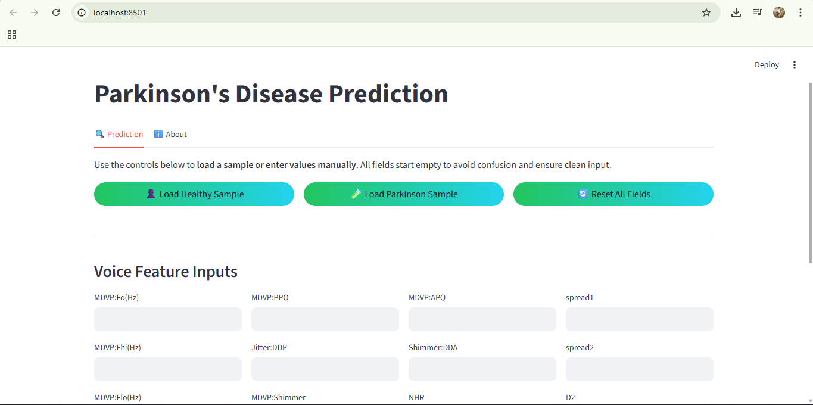
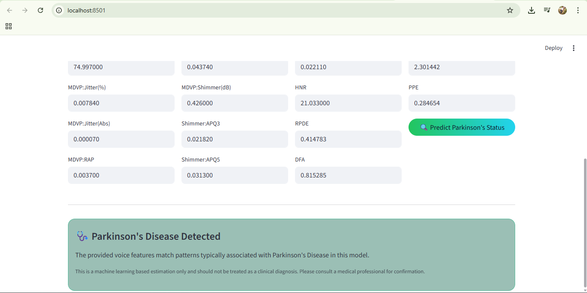

# 🧠 Parkinson's Disease Prediction App  
A modern and interactive **Machine Learning-based Parkinson’s Disease Prediction Web App** built using **Streamlit**.  
This tool analyzes **acoustic voice features** to estimate the likelihood of Parkinson’s Disease using a trained ML model.

> ⚠️ **Disclaimer:** This project is for educational and demonstration purposes only.  
It is **not** a medical diagnostic tool.

---

### 🚀 Live Demo  
🔗 **App Link:** https://parkinsons-disease-prediction-cro438tn2ubd2okdqyr7hz.streamlit.app/

---

## 📁 Project Repository  
GitHub Link: **https://github.com/akhileshnuth/parkinsons-disease-prediction**

---

## 🎯 Features  
- Modern UI with gradient background and custom styling  
- Predict Parkinson’s Disease from user-input voice features  
- Load sample **Healthy** or **Parkinson** datasets for quick testing  
- Input validation (numeric-only, empty-check)  
- Clean result display with colored result cards  
- “About” section with tech stack, GitHub, and portfolio links  
- Fully responsive layout  
- Built using Streamlit for fast deployment

---

## 🛠️ Tech Stack  
### **Frontend / UI**
- Streamlit  
- Custom CSS Styling  

### **Backend / ML**
- Python  
- NumPy  
- Pandas  
- Scikit-learn  

### **Files Referenced**
- Main Application: **app.py**  
- Requirements: **requirements.txt**  
- Model File: `parkinsons_model.sav`  
- Jupyter Notebook: `parkinsons.ipynb` (for training)

---

## 📊 Dataset  
The app uses the **UCI Parkinson’s Disease Dataset**, which includes 22 biomedical voice measurements extracted from sustained vowel phonation.

Key features used:
- Fundamental frequency measures  
- Jitter / Shimmer acoustic variations  
- Noise-to-harmonic ratios  
- Non-linear dynamical features  

---

## 📦 Installation & Setup (Local Machine)

### **1️⃣ Clone the repository**
```bash
git clone https://github.com/akhileshnuth/parkinsons-disease-prediction.git
cd parkinsons-disease-prediction
```

### **2️⃣ Install dependencies**
```bash
pip install -r requirements.txt
```

### **3️⃣ Run the Streamlit App**
```bash
streamlit run app.py
```

Your app will open in the browser at:
http://localhost:8501

---

## 📂 Folder Structure  
```bash
├── app.py                     # Main Streamlit App
├── parkinsons_model.sav       # Trained ML Model
├── parkinsons.csv             # Dataset 
├── parkinsons.ipynb           # Model Training Notebook
├── requirements.txt           # Dependencies
└── README.md                  # Documentation
```

---

## 🌐 Deployment Options  
You can deploy this app for free using:

| Platform | Supports? | Notes |
|---------|-----------|-------|
| Streamlit Cloud | ✅ Best option | Simple one-click deployment |
| Render | ✅ | Requires startup command |
| HuggingFace Spaces | ✅ | Supports Streamlit |
| Vercel | ⚠️ | Needs additional server wrapping |

---

## 🔗 Important Links  
### **GitHub**  
https://github.com/akhileshnuth

### **Portfolio**  
🚀 **https://akhilesh-portfolio-app.vercel.app/**

### 🤝 Want to Collaborate?
If you'd like to collaborate on AI/ML, web apps, or full-stack projects,  
I’m always open to exciting opportunities and teamwork!

---

## 📸 Screenshots




---

## 📜 License  
This project is licensed under the **MIT License** — feel free to use or modify it.

---

## ⭐ Support  
If you like this project, please **star the repo** and share it with others!  
It motivates me to do more projects like this.
